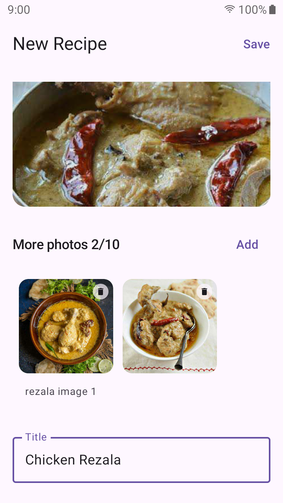
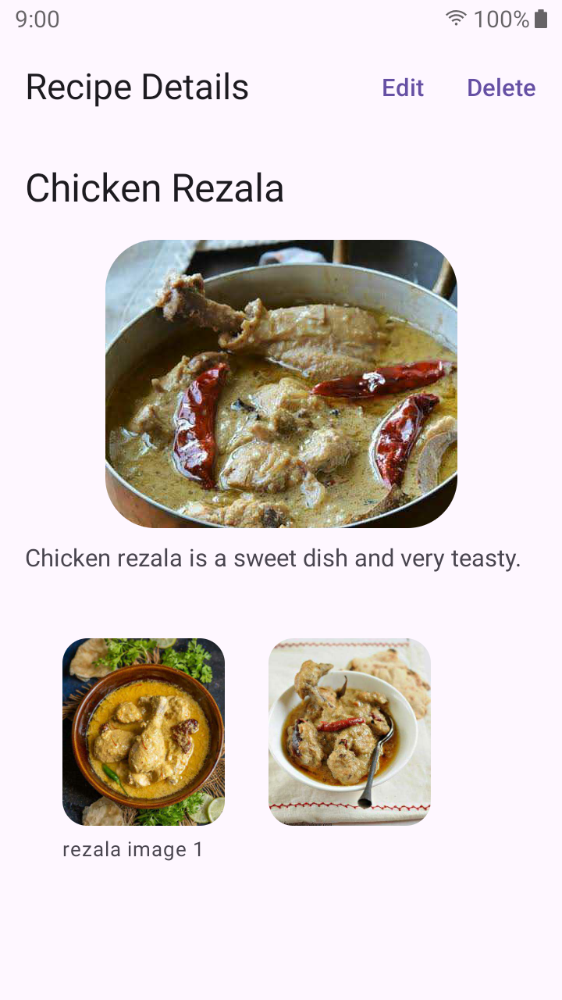
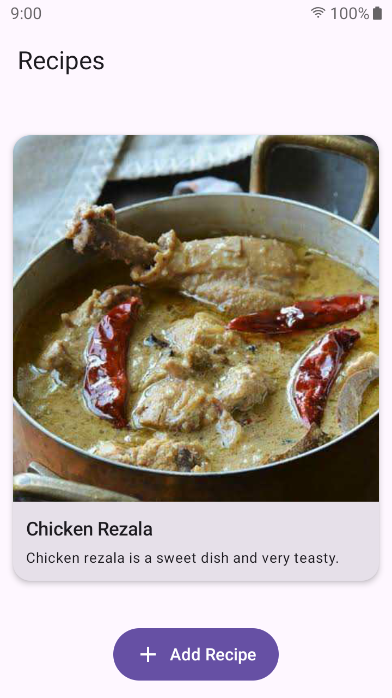

  

# Recipe Book

**Recipe Book** is a simple and practical Android app for saving and managing cooking recipes. It focuses on clean UI, offline access, and smooth performance, showing how a real-world Android app can be built using modern tools and best practices.

Users can add their own recipes, attach images, and view them anytime without needing an internet connection.

## Screenshots

| Create Recipe                            | View Recipe                        | Recipe List                        |
|------------------------------------------|------------------------------------|------------------------------------|
|  |  |  |

See all images [here](./screenshots). Do check a working example on [Youtube](https://youtube.com/shorts/9G0kU0Cs2wM)

## Features

* 📖 View a list of saved recipes with images
* 🔍 Read full recipe details (ingredients and steps)
* ➕ Add custom recipes with images from device storage
* 🗂️ Offline-first storage using local database
* ⚡ Smooth UI built with Jetpack Compose
* ♻️ Efficient image loading and caching

## Tech Stack

* **Language**: Kotlin
* **UI**: Jetpack Compose, Material 3
* **Architecture**: MVVM + Unidirectional Data Flow
* **State Management**: StateFlow, immutable UI state
* **Navigation**: Jetpack Navigation (Compose)
* **Dependency Injection**: Hilt
* **Image Loading**: Coil (with caching strategies)
* **Local Storage**: Room Database
* **Async & Background Work**: Coroutines, Flow
* **Build System**: Gradle (Version Catalog)

## Technical Challenges & Solutions

### 1. Avoiding Unnecessary Recompositions

Managing recompositions in complex Compose screens was handled by:

* Passing stable UI state objects
* Using derived state where appropriate
* Separating UI state from business logic in ViewModels

### 2. Image Caching Strategy

* Coil caching enabled for recipe images to improve scroll performance
* Caching selectively disabled for temporary image previews (e.g. image picker)
* Clear separation between local URIs and persistent image sources

### 3. Offline-First Architecture

* Room used as the single source of truth
* UI observes Flow streams from the database
* Ensures fast app startup and resilience without network access

### 4. Atomic Handling of Room and MediaStore Data

* Learned to safely coordinate **two data sources**: Room (recipe metadata) and MediaStore (images)
* Recipes and their images are saved atomically to avoid partial or inconsistent states
* Images are copied into **internal app storage** and referenced via internal URIs
* Avoids long-term dependency on system MediaStore URIs, improving reliability and data ownership

## Upcoming Features

* 🤖 **GenAI-powered auto tagging**

    * Veg / Non‑Veg classification
    * Cuisine type (Indian, Afghani, Italian, etc.)
    * Recipe type (Meal, Starter, Dessert)
    * Approximate calorie estimation
* 🌐 Find and import recipes from online sources
* 👨‍🍳 Community features to share recipes and explore others’ creations

## Important Links

**Email**: rahulstech18@gmail.com

**GitHub**: [Profile](https://github.com/rahulstech)

**LinkedIn**: [Profile](https://www.linkedin.com/in/rahul-bagchi-176a63212/)
